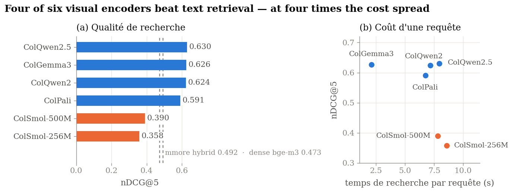
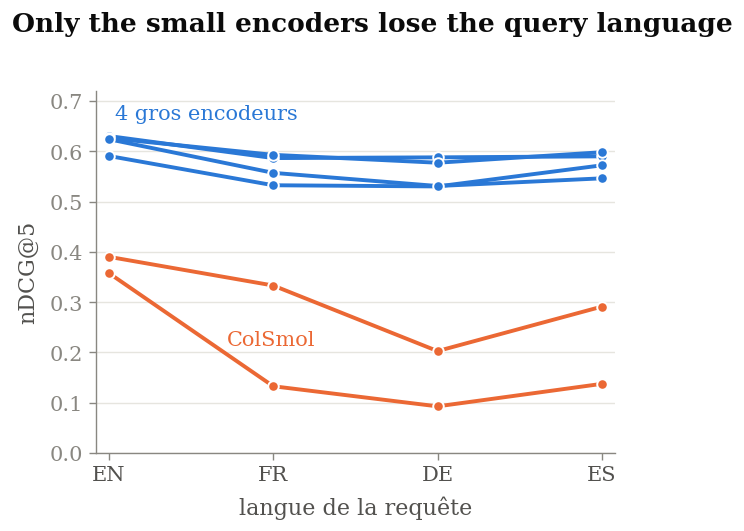
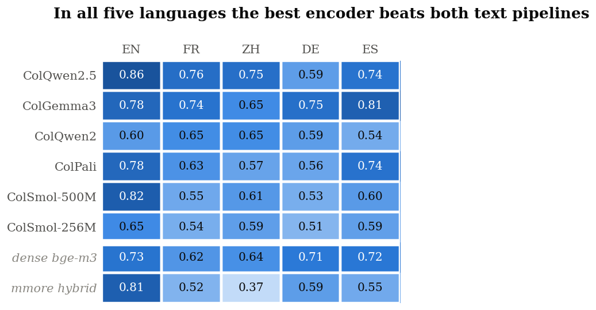

# Does visual document retrieval actually beat text retrieval?

Six **ColVision** multi-vector encoders (ColPali, ColQwen2, ColQwen2.5, ColGemma3,
ColSmol-256M/500M) benchmarked against two text retrieval pipelines inside a single
frozen RAG stack — [mmore](https://github.com/swiss-ai/mmore) — across three corpora
and 54 model cells. The suite pins an exact mmore commit and drives its CLI as a
subprocess, so every number reflects the code path a real mmore user runs, not a
reimplementation.

The headline is not a ranking. **Whether text or vision wins depends on how the query
set was written** — and most published comparisons never say.

Academic project (Cassiopée), Télécom SudParis, run on EPFL LiGHT's Run:AI cluster.

---

## 1. With vision-grounded queries, visual retrieval wins — and cost, not quality, separates the leaders



On [ViDoRe v2](https://huggingface.co/datasets/vidore) biomedical lectures — 1,016
figure-rich pages, 160 queries written by a model *looking at the page* and then
validated by human annotators, with graded multi-page relevance — four of the six
encoders beat both text pipelines. The best is **+28% nDCG@5** over mmore's own text
retriever.

The top three sit within **0.006 nDCG@5** of each other, so quality does not decide
between them. Cost does: retrieval wall-clock per query spans **2.11 s (ColGemma3) to
8.59 s (ColSmol-256M)**, and it does not track model size — the *smallest* encoder is
the slowest to query. The cost follows the number of vectors a model emits per page,
which is what mmore's MaxSim reranker iterates over, not the parameter count.
ColGemma3 delivers front-of-pack quality at a quarter of ColQwen2.5's cost.

## 2. Translating the query only hurts the small encoders



Re-asking the same 160 questions in four languages **against the index built for
English** (ViDoRe v2's official multilingual queries, not a single page re-embedded)
costs the four large encoders at most 0.09 nDCG@5. The two ColSmol models lose up to
0.27 — ColSmol-256M falls from 0.358 to 0.093. Multilingual query understanding is the
first thing model compression sacrifices.

## 3. On text-grounded queries the margin shrinks — but does not flip



A second study uses natively-written biomedical literature in five languages (PMC OA
filtered on `<Language>[Language]`; French from HAL theses — **nothing is translated**),
with English queries throughout, so retrieval is genuinely cross-lingual. Here the
queries are generated by Qwen2.5-32B-Instruct from **extracted page text**, which makes
them answerable without the image and structurally favours a text retriever.

Even so, the best encoder beats the best text pipeline in all five languages. The
measured margin is a *floor*, not a ceiling. Two side findings:

- **No single encoder dominates.** ColQwen2.5 leads on EN/FR/ZH, ColGemma3 on DE/ES.
- **mmore's out-of-the-box text path is not cross-lingual-robust.** Its hybrid fuses a
  multilingual dense encoder with an **English** SPLADE sparse model. That helps in
  English (0.812 vs 0.734 dense) and hurts everywhere else, collapsing on Chinese
  (0.372 vs 0.639). Routing by detected language — hybrid for English, dense elsewhere —
  is the obvious fix.

Full per-model tables: **[`results/SUMMARY.md`](results/SUMMARY.md)**, generated from
the records by `scripts/summarize_results.py` and never edited by hand.

---

## What was built

The benchmark is the deliverable, but most of the work is the harness around it.

- **A fixed-pipeline harness.** Index, reranker, embedding loader and retrieval
  contract are held constant; only the encoder and the corpus vary. Each cell shells out
  to mmore's real `process → index → retrieve` CLI and scores the ranked lists into one
  `BenchmarkRecord` JSON.
- **Cluster execution without SLURM.** EPFL RCP is Kubernetes + Run:AI + Harbor.
  Dependencies are not baked into the image: they install once into a venv on the scratch
  PVC that every job activates, so image rebuilds stay cheap. Four venvs coexist because
  their dependency graphs genuinely conflict (see the table below).
- **Corpus connectors.** PMC OA (with a native-language filter and a visual-density
  filter), HAL open-access theses, and a ViDoRe v2 adapter that reconstructs one PDF per
  document — sized so mmore's 200-dpi re-render reproduces the original pixels — so an
  image-only dataset flows through a PDF pipeline unchanged.
- **Query generation served in-house.** Qwen2.5-32B-Instruct on vLLM with guided-JSON
  decoding and few-shot priming, prompted per page, with the document language and the
  query language as separate parameters.
- **OCR for the image-only corpus.** ViDoRe pages carry no text layer, so the text
  baselines read mmore's own Marker+Surya OCR output rather than a shortcut extraction.
- **Provenance in every number.** Each record stores the mmore commit, the queryset
  SHA-256 and the corpus manifest hash. Every table and figure in this README is
  regenerated from those records by a script.

## Methodological honesty

The most important result in this repo is one that had to be retracted and re-derived.

An earlier version of this benchmark reported that text retrieval beat every visual
encoder by 2–4×. It was **a scoring bug**: query generation numbered pages from 0 while
mmore emits `page_num + 1`, so ColVision runs were graded against the page *before* the
relevant one — a perfect run scored 0. The text baselines were self-consistent and
therefore correct, which is exactly what made the artefact look like a finding. Fixed in
`353c076`; all 30 multilingual cells were re-scored from the stored ranked lists (no
model was re-run — the ranking never depended on the id convention), and a regression
test now asserts that a perfect run on mmore's *real* output format scores nDCG@1 = 1.0.

Other limits are stated in full in [`results/README.md`](results/README.md) and should be
read before quoting any number here. In short: one seed, so the bootstrap intervals in
`results.aggregate` collapse to zero width and are **not** confidence intervals; nDCG
uses a linear rather than exponential gain, so these figures are not directly comparable
to the published ViDoRe leaderboard; MAP and Recall are capped by `top_k=10`; latency and
VRAM are not instrumented, so the cost figures above are wall-clock on a shared,
non-isolated GPU; the two studies differ in corpus *and* in query grounding, so the
grounding effect is not isolated at fixed corpus.

## Models and baselines

| id | HF checkpoint | family | backbone |
| --- | --- | --- | --- |
| `colqwen2_5_v0_2` | `vidore/colqwen2.5-v0.2` | ColQwen2.5 | Qwen2.5-VL |
| `colgemma3_colnetra` | `Cognitive-Lab/ColNetraEmbed` | ColGemma3 | Gemma 3 |
| `colqwen2_v1_0` | `vidore/colqwen2-v1.0` | ColQwen2 | Qwen2-VL |
| `colpali_v1_3` | `vidore/colpali-v1.3` | ColPali | PaliGemma |
| `colsmol_500m` | `vidore/colSmol-500M` | ColSmol | SmolVLM |
| `colsmol_256m` | `vidore/colSmol-256M` | ColSmol | SmolVLM |

**dense** — `BAAI/bge-m3`, one embedding per page. **mmore hybrid** — mmore's own
`Indexer`/`Retriever` (dense + SPLADE, `hybrid_search_weight=0.5`, reranker off): what a
user gets from mmore's text pipeline out of the box.

Metrics: nDCG@{1,5,10}, Recall@{1,5,10}, Precision@{1,5,10}, MRR, MAP@10.

---

## Reproducing

Python 3.11 and [uv](https://docs.astral.sh/uv/). Every table and figure re-derives from
the committed records on CPU alone:

```bash
scripts/setup.sh
.venv/bin/python -m pytest tests -q
.venv/bin/python scripts/summarize_results.py   # rebuilds results/SUMMARY.md
.venv/bin/python scripts/make_figures.py        # rebuilds assets/*.png, report/figures/*.pdf
```

Running the models needs GPUs. On EPFL RCP (Kubernetes + Run:AI, no SLURM):

```bash
./scripts/rcp/setup.sh                  # builds + pushes the image, writes .rcp-env
./scripts/rcp/bootstrap-venv.sh --wait

./scripts/rcp/submit.sh corpus-vidore           # ViDoRe v2 → PDFs + graded qrels
./scripts/rcp/submit.sh corpus-lang <lang> 150 0  # PMC OA, native language
./scripts/rcp/submit.sh corpus-fr 100 0         # HAL theses
./scripts/rcp/submit.sh gen-tb <lang> <manifest> <pdfs_dir> <out.jsonl>

./scripts/rcp/submit.sh all                     # smoke + every cell
```

Each language is capped to a comparable sub-corpus (50 PDFs / 500 pages) by
`scripts/rcp/materialize_tb_lang.py`; sampling is seeded end to end, and
`bcv-corpus verify` re-hashes a local corpus against its manifest.

> **Re-running a cell:** purge it first —
> `rm -rf data/track_b_<l>/{milvus/<m>_<l>.db,process/<m>_<l>,retrieve/<m>_<l>}`.
> A partial Milvus database makes `retrieve` hang silently for hours. Cells are isolated
> by `cell_id=<model>_<lang>`, so purging one is safe while others run.

### The four scratch venvs

| venv | Purpose | Why separate |
| --- | --- | --- |
| `bcv-venv` | ColVision runs, metrics | pins `transformers==5.3.0`, required for correct ColVision weight loading |
| `bcv-venv-vllm` | Query generation | current vLLM is built for CUDA 13; the image is CUDA 12.x |
| `bcv-venv-mmoretext` | mmore hybrid baseline | SPLADE calls `batch_encode_plus`, removed in transformers 5.x → needs 4.x |
| `bcv-venv-mmoreprocess` | ViDoRe OCR (Marker+Surya) | heavy `mmore[process]` extra, unused elsewhere |

### CLIs and layout

| Command | Purpose |
| --- | --- |
| `bcv-corpus` | Corpus download, language + visual-density filters, manifest build/verify |
| `bcv-queries` | Query generation (inverse-query prompting) and ambiguity filtering |
| `bcv-run` | Orchestrate mmore `process → index → retrieve` and score a cell |
| `bcv-report` | LaTeX tables and per-study figures from the result JSONs |

```
configs/          Model and per-corpus YAML
results/          BenchmarkRecords + generated SUMMARY.md + caveats README
assets/           README figures, generated by scripts/make_figures.py
scripts/          Local setup, summariser, figure generation, rcp/ job submission
src/benchmark_colvision/
  corpus/         PMC OA / HAL / ViDoRe ingestion, filters, manifests, OCR
  queries/        LLM query generation, schema, page enumeration
  runners/        mmore CLI wrapper, orchestrators, text baselines
  evaluation/     Retrieval metrics, statistical tests
  reporting/      LaTeX tables and per-study figures
tests/            120 tests; subprocess and GPU calls are mocked
```

`pyproject.toml` pins mmore to commit `4102f96` of `Gsharpp/mmore` (`colvision` extra).
That branch carried PR #305, ColVision support, since merged upstream into
`swiss-ai/mmore` — the pin can move there directly. `uv.lock` is committed.

## License

See [LICENSE](LICENSE).
